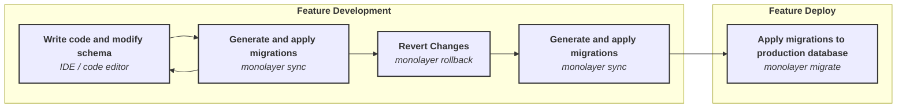

# Evolving Schema

:::warning
The workflow is simplified for illustration purposes.

In reality, it may involve more steps, such as code reviews, building and deploy artifacts, deploying multipel environments, making incremental changes to prevent non braking changes, and more.
:::

**Scenario**: Developing and releasing a new feature that requires changes to the database schema.



This workflow involves two stages:

- Feature development: During development, code is changed to implement the feature and the database schema is modified.
- Feature deploy: release the feature to users by deploying code and schema changes to the production environment.

## Feature Development

### 1. Write code and modify schema

This is the initial step where we write code and modify the database schema using and Integrated Development Environment (IDE) or code editor.

### 2. Generate and apply migrations

After making schema changes, we can generate and apply a migration with:

```bash
monolayer sync
```

`monolayer sync` will compare the current schema with the database state and generate a migration to align the database with the schema.

This step can be repeated as needed if additional schema changes are made.

### 3. Revert Changes

At this step the feature implementation is finished.

However, changes to the schema for the feature may be spread across multiple migration files.

To tidy things up, we revert to the last migration before the new feature with:

```bash
monolayer rollback
```

### 4. Generate and apply Migrations

Once the database is rolled back, we can again generate and apply migrations with:

```bash
monolayer sync
```

Now, all changes to be applied to the database will be now captured in one migration file.

## Feature Deploy

### 5. Apply migrations to production database

At the end, we can appy the migration to the production database with:

```bash
monolayer migrate -c production
```
