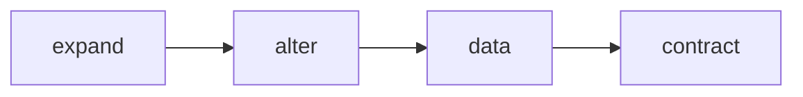

# Applying migrations

## Applying all pending migrations

You can apply all pending migrations with the following command:

```bash
npx monolayer migrations apply all
```

The command will run all phases in the following order:



::: warning Recommended only for development
It's recommended to run this command only while developing your application.

When deploying your application, you should use apply migration phases individually.
:::


## Applying migration phases individually

Each migration phase has a corresponding migration command in the CLI.

### Expand Phase

```bash
npx monolayer migrations apply expand
```
**Runs**: all pending expand migrations by timestamp.

### Alter Phase
```bash
npx monolayer migrations apply alter
```

**Runs**: all pending `alter` migrations by timestamp.

**Dependencies**: `expand` migrations. It will fail early if there are pending `expand` migrations.

### Data Phase
```bash
npx monolayer migrations apply data
```

**Runs**: all pending `data` migrations by timestamp.

**Dependencies**: `expand` and `alter` migrations. It will fail early if there are pending `expand` or `alter` migrations.

### Contract Phase
```bash
npx monolayer migrations apply contract
```

**Runs**: all pending `contract` migrations by timestamp.

**Dependencies**: `expand` and `alter` migrations. It will fail early if there are pending `expand` or `alter` migrations.

### Contract Phase - Single Migration
```bash
npx monolayer migrations apply contract single --name=<migration-name>
```

**Runs**: a single `contract` migration.

**Dependencies**: `expand` and `alter` migrations. It will fail early if there are pending `expand` or `alter` migrations.


## Rolling back migrations

You can rollback migrations with the following command:

```bash
npx monolayer migrations rollback
```

The command will prompt you to select a migration to rollback to.

::: warning Recommended only for development
You should use this command only while developing your application.

In the event that migrations fail in production environments, it's best to always move forward by fixing the underlying issue and then either re-apply migrations or generate new ones.
:::
