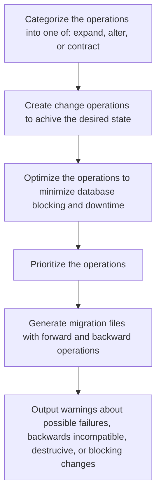

# Generating Migrations

To generate schema migrations based on what you have declared are generated using the `monolayer-pg` CLI with the `migrations generate` command:

```bash
npx monolayer migrations generate
```

`monolayer-pg` will then introspect the schema defined in your application code and the actual database schema in your development database. If there are chages to be made it will:



## Custom migrations

You'll find instructions on how to generate custom migrations in the recipe: [Generating custom migrations](./../recipes/custom-migrations.md).
