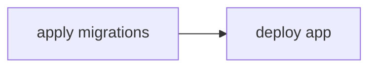
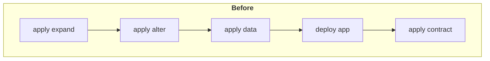

# Introduction

`monolayer` combines a declarative schema approach, database introspection, and change categorization to structure migrations around their intent.

Migrations are categorized into distinct phases:

| Phase      | Description     |
| :------------| :----------- |
| **Expand**     | Adding elements to the schema that are backwards compatible (will not disrupt existing functionality), such as adding new tables, columns with non volatile default values, or indexes. |
| **Alter**   | Modifying the schema in a way that could disrupt current functionality, such as adding constraints, modifying column types, renaming tables. |
| **Data** | Applying data changes to the database, such as populating new tables with data. |
| **Contract**    | Removing schema elements that are no longer needed, such as dropping tables no longer used. |

When generating migrations with the CLI, `monolayer` automatically splits schema migrations into either `expand`, `alter`, or `contract` migrations.

`data` migrations are manually generated through the CLI and their content is written by you.

## Traditional migration systems

Traditional database migration systems, ORMs, and frameworks typically operate with linear migrations.

However, once you require granular control over which changes should be applied and when, you'll hit a ceiling by the lack of flexibility to automate such specific changes.

Consider a scenario where a column in a database table is no longer needed, and you want to remove it.

::: info ASSUMPTIONS
1) You intent to evolve your database schema.
2) You use a traditional migration system, for example Prisma.
3) You have an automated deployment pipeline, that at some point does this:

4) You want to avoid downtime.
:::

In your application code, you perform the following steps:
1. Remove references to column you want to remove.
2. Generate a migration to drop the column from the database.

If your deployment pipeline runs as usual, the column will be dropped before the new application code is live. This can cause the current application version to malfunction, leading to potential downtime. Additionally, if the application deployment fails after the migration, the application may end up in a broken state.

#### Approach 1: release management
One way to avoid disrupting your deployment pipeline is to split the release into two separate stages:
1. Deploy the updated application code that no longer references the column.
2. Deploy the migration to drop the column.

While this approach is effective, it increases the complexity of the development process and disrupts the automated deployment loop. You must:
- Prepare two separate releases.
- Coordinate the correct sequence of these releases.
- Ensure no other releases occur between the two.

#### Approach 2: develop tooling on top of your database migration tool

Another approach is to modify your deployment pipeline so that certain migrations are applied only after the deployment. However, this approach requires you to build and maintain custom tools. It's really tempting to understimate the effort needed to design and build that kind of tooling:
- Does my database migration tool support running single migrations?
- How do you identify migrations that must be executed after application deploy?
- If migrations are split into pre-app-deployment and post-app-deployment phases, do you want to apply all pending migrations or flag specific ones?

#### Approach 3: Minimize downtime impact

A third approach is to schedule the release during off-peak hours when disruptions are less impactful. This minimizes the impact of downtime but may not fully eliminate it.

## The monolayer approach

With `monolayer`, ypu can safely deploy without downtime the column drop.

When you generate a migration to drop the column from the database, `monolayer` will automatically categorize the migration as a **Contract** migration.

At deploy time, you can granularly control which migrations are applied, allowing you to:
- Apply the necessary migrations for the new application version (`expand`, `alter`, `data`).
- Skip the migration to drop the column to the a point in time when the column is no longer being accessed. (`contract`).

Your typical deployment pipeline will change to look like this:

This deployment loop can be applied over and over again, and it allows you to continuously evolve your database schema and integrate "expand and contract" migration patterns seamlessly in your workflow.

Also, with the ability to apply a single contract migration with `migrations apply contract single`, you can start build a custom logic on top of it (i.e. contract all migrations that are older than a certain date).
